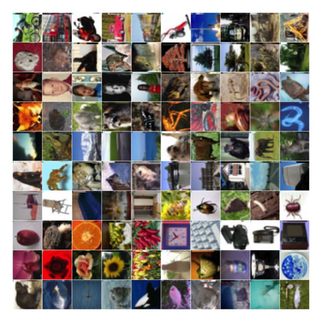
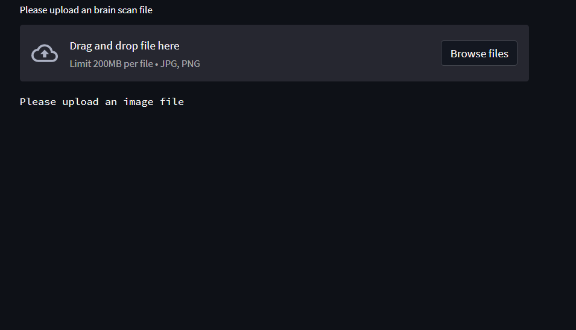
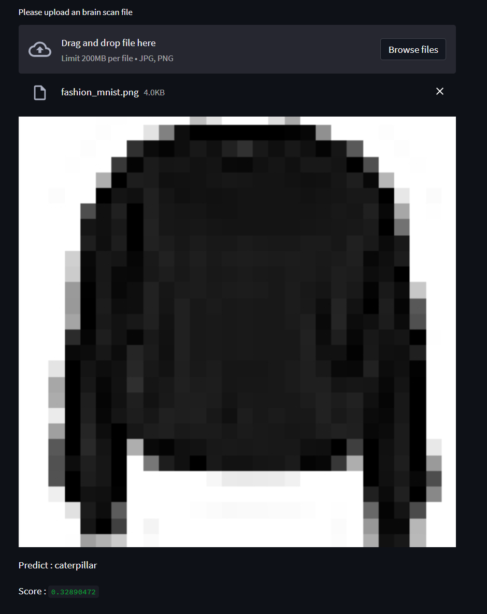

# Cifar100
This [dataset](https://keras.io/api/datasets/cifar100/) is just like the CIFAR-10, except it has 100 classes containing 600 images each. There are 500 training images
and 100 testing images per class. The 100 classes in the CIFAR-100 are grouped into 20 superclasses. Each image comes with a
"fine" label (the class to which it belongs) and a "coarse" label (the superclass to which it belongs).



## Clone recursively
``` shell
git clone https://github.com/yahyoxonqwe/cifar100.git
```
## Enter this file
``` shell
cd cifar100
```
## Install Virtual environment
To use the CIFAR-100 dataset, it is recommended to create a virtual environment in Python. You can do this by using the virtualenv package. First, install virtualenv using pip:
``` shell
python -m pip install --user virtualenv
```
## give a name this environment
``` shell
python -m venv your_env
```
## Activate this environment
``` shell
your_env\Scripts\activate.bat
```
## Install requirements
``` shell
pip install -r requirement.txt
```
## Open jupyter notebook
``` shell
jupyter notebook
```
## Run streamlit
``` shell
streamlit run streamlit.py
```


## Predict

